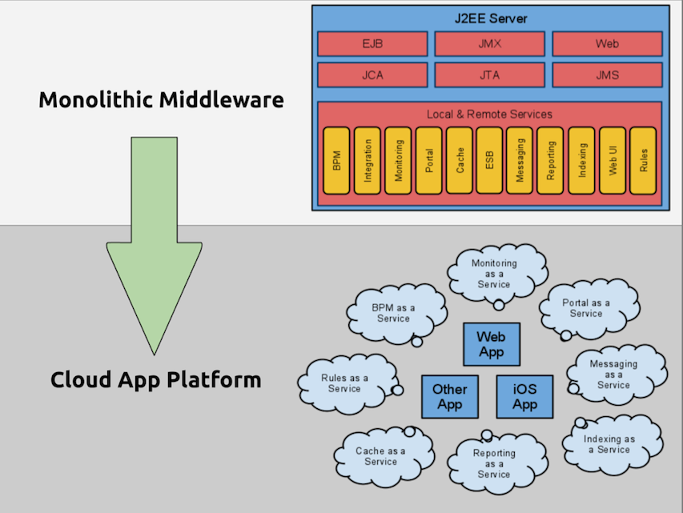

<!SLIDE>

# Connect to a Database

* Free shared Postgres DB
* Dedicated & managed Postgres DB
* Amazon RDS: MySQL, Oracle
* NoSQL Addons: (Redis, MongoDB, etc)
* database.com
* Or anything else

<!SLIDE>

# Use a Heroku Addon

1. Find an addon: http://addons.heroku.com/
2. Activate the addon
3. Use the service
4. Push to Heroku

<!SLIDE center>

<!SLIDE>

# The Process Model

* Web - Http Requests
* Worker - Read Jobs from a Queue
* One-off Admin - Maintenance Jobs
* Scheduled - Batch Processing

<!SLIDE>

# Play! on Heroku

* Rapid development
* Webapps by convention
* Natively supported on Heroku

<!SLIDE>

# Play! Demo
